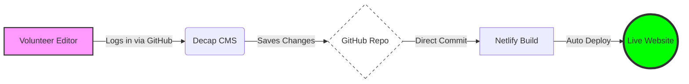

[](https://app.netlify.com/projects/enchanting-tanuki-85b671/deploys)

# Tahoma Orchestra Boosters Website

## What is it?

A simple, initial build of a fast, pre-generated HTML website for the Tahoma Orchestra Boosters using the [Eleventy](https://www.11ty.dev/) static site generator. With [Decap CMS](https://www.decapcms.org/) (formerly Netlify CMS) baked-in.

Based on the [Eleventy Base Blog](https://github.com/11ty/eleventy-base-blog) repo (see there for additional info on Eleventy usage).

## Features

* Uses Eleventy 3
* Decap CMS with editor previews
* Scores 100/100/100/100 in Lighthouse performance tests 🔥
* Automatic navigation menus with [Eleventy Navigation](https://www.11ty.dev/docs/plugins/navigation/)
* CSS 2kb minified, inlined for fastest page render
* Pre-builds and minifies HTML elements
* Uses Markdown files for content
* Uses Nunjucks templates for layout
* Continuous Deployment workflow via Netlify

## Why this Design

Using a Content Management System allows content updates without directly touching code.  The site is generally uncomplicated
but also run by volunteers so low-change and simplicity are goals.  There are services that integrate a CMS into the site but
these frequently run server-side and require additional cost/capacity to run.  Running a static "Single-Page" site is a simple
way to reduce hosting requirements as well since no logic is executed server side (the site is either very-cheap or free to host).
Lastly, because nothing in the site is private or requires secrets, we don't need closed or hidden content.

### How it works



## Technical Configuration

### Authentication
The CMS is configured using the **GitHub OAuth** backend. 
- **OAuth Provider:** Managed via Netlify Site Configuration (Access & security > OAuth).
- **Callback URL:** `https://api.netlify.com/auth/done`
- **Backend Type:** `github` (configured in `admin/config.yml`).

### Deployment
- **SSG:** Eleventy (11ty)
- **Host:** Netlify
- **CMS:** Decap CMS

## Admin Access & Editing

**Decap CMS** with github OAuth means that all users need at least a github account (but do not need to use github directly).
Adding users requires adding them as collaborators to the main repository.  Changes in Decap result in updates to the github
repo, triggering builds in Netlify.  Builds produce a new static site based on the content edits.

### How to Log In
1. Go to [https://tahomaorchestraboosters.netlify.app/admin/](https://tahomaorchestraboosters.netlify.app/admin/)
2. Click **"Login with GitHub"**.
3. If you have permission, you will be redirected to the dashboard where you can edit pages, news, and calendar events.

### How to Add New Editors
Because we use GitHub OAuth, permissions are managed through GitHub directly, not Netlify:
1. The new volunteer must have a GitHub account, (can use their GMail for this).
2. An existing Repository Admin must go to **Settings > Collaborators** on this GitHub repo.
3. Invite the volunteer with **Write** access.
4. The volunteer **must accept the email invitation** from GitHub before they can log in to the CMS.

### Editing the site

When changes are made to the site and the publish button is clicked the site will begin building immediately. Building generally
consumes more credits than serving the site so if you're making a lot of changes consider pausing builds in Netlify so that the
credits aren't burned up.  Without adding any 501c3 benefits, there are enough credits in the Netlify free tier for a couple builds
per week plus serving. Changes to the site are generally live within a few minutes.

## Local development

### 1. Clone this repository:

```
git clone https://github.com/jamutton/tahomaorchestraboosters.git tahomaorchestraboosters
```

### 2. Navigate to the directory

```
cd tahomaorchestraboosters
```

Specifically have a look at `.eleventy.js` to see if you want to configure any Eleventy options differently.

### 3. Install dependencies locally

```
npm install @11ty/eleventy
```

### 4. Edit _data/metadata.json

This file contains your site title and author details, and can be used to store any other commonly used site data.

### 5. Run Eleventy (builds the site)

```
npx @11ty/eleventy
```

Or build automatically when a template changes:
```
npx @11ty/eleventy --watch
```

Or build and host locally for local development:
```
npx @11ty/eleventy --serve
```

Or in debug mode:
```
DEBUG=* npx @11ty/eleventy
```

## Bug reports, feature requests, etc

This is an ongoing and volunteer-led project with the Tahoma Music program.  We're happy to consider contributions and suggestions! Feel free to submit a PR.
